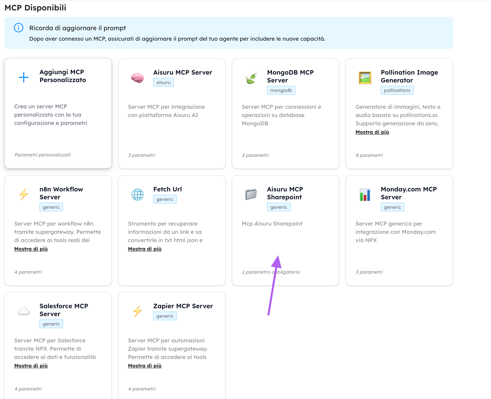

# mcp-sharepoint

A **Model Context Protocol (MCP) server** that exposes core **Microsoft SharePoint / Microsoft Graph API** functionalities as tools usable by LLM agents (e.g. Claude Desktop).

This server is designed with an **agent-first approach**:

* no direct access to the local filesystem
* deterministic inputs and outputs

---

## ✨ Features

The server allows an agent to:

### 📁 Folder management

A path can/must be passed as an argument

* List folders
* Create new folder
* Delete folder (only if empty)
* Retrieve the folder tree structure

### 📄 Document management

A path can/must be passed as an argument

* List documents
* Read document content (PDF, Word, Excel, PowerPoint)
* Upload new document (text or binary)
* Update an existing document (replace the full content)
* Delete document

---

## 🔐 Prerequisites

* Node.js
* A Microsoft 365 tenant
* An app registered in **Microsoft Entra ID** with Graph permissions

### Recommended Graph permissions

```
Sites.Read.All
Sites.ReadWrite.All
Files.Read.All
Files.ReadWrite.All
```

> ⚠️ Use **Application permissions**

---

* Authentication through **Microsoft Entra ID App Registration**
* All operations are performed via **Microsoft Graph**

---

## Step by step guide
1. On Microsoft Entra website `https://entra.microsoft.com/`, click on the left menu on "app registration"
2. Click on top on "New registration"
3. Insert a name and click "Register"
4. Open the new registered app, by clicking on its name in "app registration"
5. On top infos you can see the **client id** and **tenant id** as ID application (client) and ID directory (tenant)
6. Click on "Client credentials: 0 certificates, 0 secrets"
7. Click on "New client secret"
8. Insert the desired description and expire time, and click "Add"
9. In the table there will be the new client secret, copy the "Value" field.  
> ⚠️You can copy it only once, after you will not be able to see the "Value" again  
10. The copied "Value" is the **client secret**
11. Make this request to obtain an access_token needed for the successive requests:
```
curl --request POST \
  --url "https://login.microsoftonline.com/<TENANT_ID>/oauth2/v2.0/token" \
  --header "Content-Type: application/x-www-form-urlencoded" \
  --data-urlencode "client_id=<CLIENT_ID>" \
  --data-urlencode "client_secret=<CLIENT_SECRET>" \
  --data-urlencode "scope=https://graph.microsoft.com/.default" \
  --data-urlencode "grant_type=client_credentials"
```
The response is a json, you only need the attribute "access_token"  
12. Make this request to obtain the **site id**, the domain name and site name can be seen on the URL in your Sharepoint site: `https://<DOMAIN_NAME>.sharepoint.com/sites/<SITE_NAME>/...`
```
curl -X GET "https://graph.microsoft.com/v1.0/sites/<DOMAIN_NAME>.sharepoint.com:/sites/<SITE_NAME>?select=id" \
  -H "Authorization: Bearer <ACCESS_TOKEN>" \
  -H "Accept: application/json"
```
The response is a json, you only need the attribute "id"  
13. Make this request to obtain the **drive id**
```
curl -X GET "https://graph.microsoft.com/v1.0/sites/<SITE_ID>/drives?select=id,name" \
  -H "Authorization: Bearer <ACCESS_TOKEN>" \
  -H "Accept: application/json"
```
The response is a json, the attribute "value" is an array of json, each json is a different drive, you only need the attribute "id"  
14. Make this request to obtain the **list id**
```
curl -s -X GET "https://graph.microsoft.com/v1.0/sites/<SITE_ID>/lists?select=id,displayName" \
  -H "Authorization: Bearer <ACCESS_TOKEN>" \
  -H "Accept: application/json"
```
The response is a json, the attribute "value" is an array of json, each json is a different list, you only need the attribute "id"

## ⚙️ Configuration

The authorization is obtained using **app variables**.
These variables must be provided in every call.

### Required app variables

| Variable      | Description                              |
| ------------- | ---------------------------------------- |
| `tenantId`    | Microsoft Entra directory tenant ID      |
| `clientId`    | Microsoft Entra app client ID            |
| `clientSecret`| Microsoft Entra client secret            |

Other common variables needed.
These depends on the Sharepoint you are using.

| Variable      | Description                              |
| ------------- | ---------------------------------------- |
| `siteId`      | Sharepoint full site ID                  |
| `driveId`     | Sharepoint drive ID                      |
| `listId`      | Sharepoint list ID                       |

---

## 🧰 Available MCP tools

### 📁 Folders

#### `getFolders`

List folders in a given path.

**Input**:
```
{
  "name": "clientId",
  "type": "string",
  "required": "true",
  "descrciption": "The application (client) ID",
  "example": "ab12cd34-e5f6-g7h8-i9j9-ab12cd34e5f6"
},
{
  "name": "clientSecret",
  "type": "string",
  "required": "true",
  "descrciption": "The client secret",
  "example": "1~A1B~aB12Cd34E5f6aB12cd34E5f6ab~d37cD37"
},
{
  "name": "tenantId",
  "type": "string",
  "required": "true",
  "descrciption": "The directory (tenant) ID",
  "example": "ab12cd34-e5f6-g7h8-i9j9-ab12cd34e5f6"
},
{
  "name": "siteId",
  "type": "string",
  "required": "true",
  "descrciption": "The ID of the SharePoint site",
  "example": "namexyz.sharepoint.com,ab12cd34-e5f6-g7h8-i9j9-ab12cd34e5f6,fb12cd34-e5f6-g7h8-i9j9-ab12cd34e5f9"
},
{
  "name": "driveId",
  "type": "string",
  "required": "true",
  "descrciption":" The ID of the drive within the SharePoint site",
  "example": "f!aB12Cd34E5f6aB12cd34E5f6abd37cD37aB12Cd34E5f6aB12cd34E5f6abd3712"
},
{
  "name": "path",
  "type": "string",
  "required": "true",
  "descrciption": "The path in SharePoint to retrieve folders from",
  "example": "cartella_1/cartella_2"
}
```

---

#### `createFolder`

Create a new folder.

**Input**:
```
{
  "name": "clientId",
  "type": "string",
  "required": "true",
  "descrciption": "The application (client) ID",
  "example": "ab12cd34-e5f6-g7h8-i9j9-ab12cd34e5f6"
},
{
  "name": "clientSecret",
  "type": "string",
  "required": "true",
  "descrciption": "The client secret",
  "example": "1~A1B~aB12Cd34E5f6aB12cd34E5f6ab~d37cD37"
},
{
  "name": "tenantId",
  "type": "string",
  "required": "true",
  "descrciption": "The directory (tenant) ID",
  "example": "ab12cd34-e5f6-g7h8-i9j9-ab12cd34e5f6"
},
{
  "name": "siteId",
  "type": "string",
  "required": "true",
  "descrciption": "The ID of the SharePoint site",
  "example": "namexyz.sharepoint.com,ab12cd34-e5f6-g7h8-i9j9-ab12cd34e5f6,fb12cd34-e5f6-g7h8-i9j9-ab12cd34e5f9"
},
{
  "name": "driveId",
  "type": "string",
  "required": "true",
  "descrciption":" The ID of the drive within the SharePoint site",
  "example": "f!aB12Cd34E5f6aB12cd34E5f6abd37cD37aB12Cd34E5f6aB12cd34E5f6abd3712"
},
{
  "name": "path",
  "type": "string",
  "required": "true",
  "descrciption": "The parent path where the folder will be created",
  "example": "cartella_1/cartella_2"
},
{
  "name": "folderName",
  "type": "string",
  "required": "true",
  "descrciption": "The name of the new folder to create",
  "example": "cartella_3"
}
```
---

#### `deleteFolder`

Delete a folder **only if it is empty**.

**Input**:
```
{
  "name": "clientId",
  "type": "string",
  "required": "true",
  "descrciption": "The application (client) ID",
  "example": "ab12cd34-e5f6-g7h8-i9j9-ab12cd34e5f6"
},
{
  "name": "clientSecret",
  "type": "string",
  "required": "true",
  "descrciption": "The client secret",
  "example": "1~A1B~aB12Cd34E5f6aB12cd34E5f6ab~d37cD37"
},
{
  "name": "tenantId",
  "type": "string",
  "required": "true",
  "descrciption": "The directory (tenant) ID",
  "example": "ab12cd34-e5f6-g7h8-i9j9-ab12cd34e5f6"
},
{
  "name": "siteId",
  "type": "string",
  "required": "true",
  "descrciption": "The ID of the SharePoint site",
  "example": "namexyz.sharepoint.com,ab12cd34-e5f6-g7h8-i9j9-ab12cd34e5f6,fb12cd34-e5f6-g7h8-i9j9-ab12cd34e5f9"
},
{
  "name": "driveId",
  "type": "string",
  "required": "true",
  "descrciption":" The ID of the drive within the SharePoint site",
  "example": "f!aB12Cd34E5f6aB12cd34E5f6abd37cD37aB12Cd34E5f6aB12cd34E5f6abd3712"
},
{
  "name": "path",
  "type": "string",
  "required": "true",
  "descrciption": "The path to the folder to delete",
  "example": "cartella_1/cartella_2/cartella_3"
}
```
---

#### `getFolderTree`

Retrieve the folder tree structure.

**Input**:
```
{
  "name": "clientId",
  "type": "string",
  "required": "true",
  "descrciption": "The application (client) ID",
  "example": "ab12cd34-e5f6-g7h8-i9j9-ab12cd34e5f6"
},
{
  "name": "clientSecret",
  "type": "string",
  "required": "true",
  "descrciption": "The client secret",
  "example": "1~A1B~aB12Cd34E5f6aB12cd34E5f6ab~d37cD37"
},
{
  "name": "tenantId",
  "type": "string",
  "required": "true",
  "descrciption": "The directory (tenant) ID",
  "example": "ab12cd34-e5f6-g7h8-i9j9-ab12cd34e5f6"
},
{
  "name": "siteId",
  "type": "string",
  "required": "true",
  "descrciption": "The ID of the SharePoint site",
  "example": "namexyz.sharepoint.com,ab12cd34-e5f6-g7h8-i9j9-ab12cd34e5f6,fb12cd34-e5f6-g7h8-i9j9-ab12cd34e5f9"
},
{
  "name": "driveId",
  "type": "string",
  "required": "true",
  "descrciption":" The ID of the drive within the SharePoint site",
  "example": "f!aB12Cd34E5f6aB12cd34E5f6abd37cD37aB12Cd34E5f6aB12cd34E5f6abd3712"
},
{
  "name": "path",
  "type": "string",
  "required": "false",
  "descrciption": "The starting path (default: 'root')",
  "example": "cartella_1/cartella_2"
},
{
  "name": "maxDepth",
  "type": "number",
  "required": "false",
  "descrciption": "Maximum depth to traverse (default: 10)",
  "example": 5
}
```
---

### 📄 Documents

#### `getDocuments`

List documents in a folder.

**Input**:
```
{
  "name": "clientId",
  "type": "string",
  "required": "true",
  "descrciption": "The application (client) ID",
  "example": "ab12cd34-e5f6-g7h8-i9j9-ab12cd34e5f6"
},
{
  "name": "clientSecret",
  "type": "string",
  "required": "true",
  "descrciption": "The client secret",
  "example": "1~A1B~aB12Cd34E5f6aB12cd34E5f6ab~d37cD37"
},
{
  "name": "tenantId",
  "type": "string",
  "required": "true",
  "descrciption": "The directory (tenant) ID",
  "example": "ab12cd34-e5f6-g7h8-i9j9-ab12cd34e5f6"
},
{
  "name": "siteId",
  "type": "string",
  "required": "true",
  "descrciption": "The ID of the SharePoint site",
  "example": "namexyz.sharepoint.com,ab12cd34-e5f6-g7h8-i9j9-ab12cd34e5f6,fb12cd34-e5f6-g7h8-i9j9-ab12cd34e5f9"
},
{
  "name": "driveId",
  "type": "string",
  "required": "true",
  "descrciption":" The ID of the drive within the SharePoint site",
  "example": "f!aB12Cd34E5f6aB12cd34E5f6abd37cD37aB12Cd34E5f6aB12cd34E5f6abd3712"
},
{
  "name": "path",
  "type": "string",
  "required": "true",
  "descrciption": "The path in SharePoint to retrieve documents from",
  "example": "cartella_1/cartella_2"
}
```
---

#### `getDocumentContent`

Retrieve and extract the textual content of a document.

Supported formats:

* Native PDFs
* Word / Excel / PowerPoint (converted to PDF via Graph)

**Input**:
```
{
  "name": "clientId",
  "type": "string",
  "required": "true",
  "descrciption": "The application (client) ID",
  "example": "ab12cd34-e5f6-g7h8-i9j9-ab12cd34e5f6"
},
{
  "name": "clientSecret",
  "type": "string",
  "required": "true",
  "descrciption": "The client secret",
  "example": "1~A1B~aB12Cd34E5f6aB12cd34E5f6ab~d37cD37"
},
{
  "name": "tenantId",
  "type": "string",
  "required": "true",
  "descrciption": "The directory (tenant) ID",
  "example": "ab12cd34-e5f6-g7h8-i9j9-ab12cd34e5f6"
},
{
  "name": "siteId",
  "type": "string",
  "required": "true",
  "descrciption": "The ID of the SharePoint site",
  "example": "namexyz.sharepoint.com,ab12cd34-e5f6-g7h8-i9j9-ab12cd34e5f6,fb12cd34-e5f6-g7h8-i9j9-ab12cd34e5f9"
},
{
  "name": "driveId",
  "type": "string",
  "required": "true",
  "descrciption":" The ID of the drive within the SharePoint site",
  "example": "f!aB12Cd34E5f6aB12cd34E5f6abd37cD37aB12Cd34E5f6aB12cd34E5f6abd3712"
},
{
  "name": "filePath",
  "type": "string",
  "required": "true",
  "descrciption": "The path to the file",
  "example": "cartella_1/cartella_2/file.txt"
}
```
---

#### `uploadDocument`

Upload a new document.

**Input**:
```
{
  "name": "clientId",
  "type": "string",
  "required": "true",
  "descrciption": "The application (client) ID",
  "example": "ab12cd34-e5f6-g7h8-i9j9-ab12cd34e5f6"
},
{
  "name": "clientSecret",
  "type": "string",
  "required": "true",
  "descrciption": "The client secret",
  "example": "1~A1B~aB12Cd34E5f6aB12cd34E5f6ab~d37cD37"
},
{
  "name": "tenantId",
  "type": "string",
  "required": "true",
  "descrciption": "The directory (tenant) ID",
  "example": "ab12cd34-e5f6-g7h8-i9j9-ab12cd34e5f6"
},
{
  "name": "siteId",
  "type": "string",
  "required": "true",
  "descrciption": "The ID of the SharePoint site",
  "example": "namexyz.sharepoint.com,ab12cd34-e5f6-g7h8-i9j9-ab12cd34e5f6,fb12cd34-e5f6-g7h8-i9j9-ab12cd34e5f9"
},
{
  "name": "driveId",
  "type": "string",
  "required": "true",
  "descrciption":" The ID of the drive within the SharePoint site",
  "example": "f!aB12Cd34E5f6aB12cd34E5f6abd37cD37aB12Cd34E5f6aB12cd34E5f6abd3712"
},
{
  "name": "filePath",
  "type": "string",
  "required": "true",
  "descrciption": "The path where the file will be uploaded",
  "example": "cartella_1/cartella_2"
},
{
  "name": "content",
  "type": "string",
  "required": "true",
  "descrciption": "The string or base64-encoded content of the file to upload",
  "example": "Questo è il testo del doc .txt"
},
{
  "name": "contentType",
  "type": "string",
  "required": "false",
  "descrciption": "The MIME type of the content (default: 'application/octet-stream')",
  "example": "application/octet-stream"
},
{
  "name": "overwrite",
  "type": "boolean",
  "required": "false",
  "descrciption": "Whether to overwrite existing files (default: false)",
  "example": true
}
```

---

#### `updateDocumentContent`

Fully update an existing document.

> ⚠️ The operation replace the full content of the file.  
> ⚠️ The operation fails if the file does not exist.

**Input**:
```
{
  "name": "clientId",
  "type": "string",
  "required": "true",
  "descrciption": "The application (client) ID",
  "example": "ab12cd34-e5f6-g7h8-i9j9-ab12cd34e5f6"
},
{
  "name": "clientSecret",
  "type": "string",
  "required": "true",
  "descrciption": "The client secret",
  "example": "1~A1B~aB12Cd34E5f6aB12cd34E5f6ab~d37cD37"
},
{
  "name": "tenantId",
  "type": "string",
  "required": "true",
  "descrciption": "The directory (tenant) ID",
  "example": "ab12cd34-e5f6-g7h8-i9j9-ab12cd34e5f6"
},
{
  "name": "siteId",
  "type": "string",
  "required": "true",
  "descrciption": "The ID of the SharePoint site",
  "example": "namexyz.sharepoint.com,ab12cd34-e5f6-g7h8-i9j9-ab12cd34e5f6,fb12cd34-e5f6-g7h8-i9j9-ab12cd34e5f9"
},
{
  "name": "driveId",
  "type": "string",
  "required": "true",
  "descrciption":" The ID of the drive within the SharePoint site",
  "example": "f!aB12Cd34E5f6aB12cd34E5f6abd37cD37aB12Cd34E5f6aB12cd34E5f6abd3712"
},
{
  "name": "filePath",
  "type": "string",
  "required": "true",
  "descrciption": "The path to the existing file to update",
  "example": "cartella_1/cartella_2"
},
{
  "name": "content",
  "type": "string",
  "required": "true",
  "descrciption": "The new string or base64-encoded content of the file",
  "example": "Questo è il nuovo testo del doc .txt"
},
{
  "name": "contentType",
  "type": "string",
  "required": "false",
  "descrciption": "The MIME type of the content (default: 'application/octet-stream')",
  "example": "application/pdf"
}
```
---

#### `deleteDocument`

Delete a document (moved to the SharePoint recycle bin).

**Input**:
```
{
  "name": "clientId",
  "type": "string",
  "required": "true",
  "descrciption": "The application (client) ID",
  "example": "ab12cd34-e5f6-g7h8-i9j9-ab12cd34e5f6"
},
{
  "name": "clientSecret",
  "type": "string",
  "required": "true",
  "descrciption": "The client secret",
  "example": "1~A1B~aB12Cd34E5f6aB12cd34E5f6ab~d37cD37"
},
{
  "name": "tenantId",
  "type": "string",
  "required": "true",
  "descrciption": "The directory (tenant) ID",
  "example": "ab12cd34-e5f6-g7h8-i9j9-ab12cd34e5f6"
},
{
  "name": "siteId",
  "type": "string",
  "required": "true",
  "descrciption": "The ID of the SharePoint site",
  "example": "namexyz.sharepoint.com,ab12cd34-e5f6-g7h8-i9j9-ab12cd34e5f6,fb12cd34-e5f6-g7h8-i9j9-ab12cd34e5f9"
},
{
  "name": "driveId",
  "type": "string",
  "required": "true",
  "descrciption":" The ID of the drive within the SharePoint site",
  "example": "f!aB12Cd34E5f6aB12cd34E5f6abd37cD37aB12Cd34E5f6aB12cd34E5f6abd3712"
},
{
  "name": "filePath",
  "type": "string",
  "required": "true",
  "descrciption": "The path to the file to delete",
  "example": "cartella_1/cartella_2/file.docx"
},
```
---

#### `searchDocumentsByKeywords`

Search for documents containing at least one of the keywords in the given attribute.

**Input**:
```
{
  "name": "clientId",
  "type": "string",
  "required": "true",
  "descrciption": "The application (client) ID",
  "example": "ab12cd34-e5f6-g7h8-i9j9-ab12cd34e5f6"
},
{
  "name": "clientSecret",
  "type": "string",
  "required": "true",
  "descrciption": "The client secret",
  "example": "1~A1B~aB12Cd34E5f6aB12cd34E5f6ab~d37cD37"
},
{
  "name": "tenantId",
  "type": "string",
  "required": "true",
  "descrciption": "The directory (tenant) ID",
  "example": "ab12cd34-e5f6-g7h8-i9j9-ab12cd34e5f6"
},
{
  "name": "siteId",
  "type": "string",
  "required": "true",
  "descrciption": "The ID of the SharePoint site",
  "example": "namexyz.sharepoint.com,ab12cd34-e5f6-g7h8-i9j9-ab12cd34e5f6,fb12cd34-e5f6-g7h8-i9j9-ab12cd34e5f9"
},
{
  "name": "listId",
  "type": "string",
  "required": "true",
  "descrciption": "The ID of the SharePoint list to search in",
  "example": "ab12cd34-e5f6-g7h8-i9j9-ab12cd34e5f6"
},
{
  "name": "keywords",
  "type": "Array<string>",
  "required": "true",
  "descrciption": "Array of keywords to search for",
  "example": "["word_1", "word_2", "word_3"]"
},
{
  "name": "attributeName",
  "type": "string",
  "required": "true",
  "descrciption": The document attribute to search in",
  "example": "name"
},
```

---

### 🚀 Try it on Aisuru!

This MCP server is easily integrated into [aisuru](https://aisuru.com/), our AI agent platform where you can create, test, and deploy intelligent agents with access to powerful tools like this mcp-sharepoint server.



Visit [Aisuru.com](https://aisuru.com/) to start building with your agents today!

---

## ⚠️ Known limitations

* Partial document updates are not supported
* Large files (>4MB) require upload sessions (not yet implemented)
* Text extraction from complex PDFs/Excel files may lose structure

---

## 🔒 Security

* Never expose `client secret` publicly
* Rotate secrets regularly
* Grant the minimum required Graph permissions


